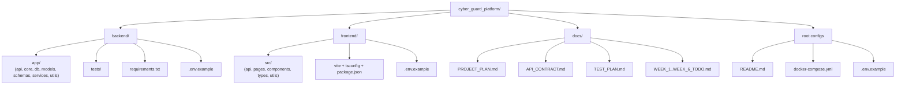
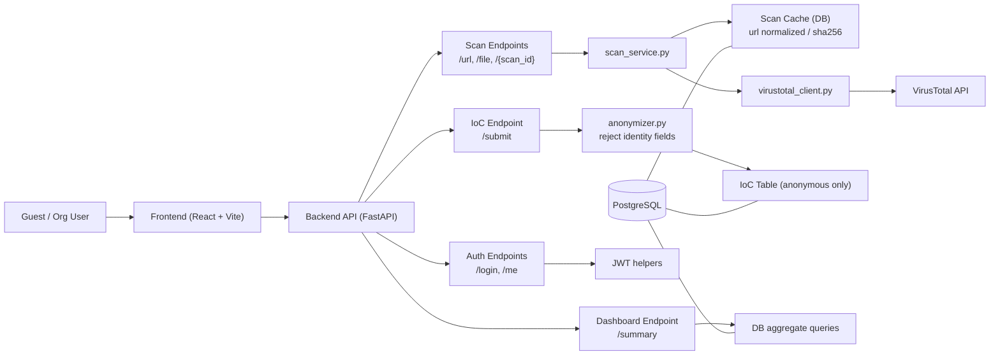
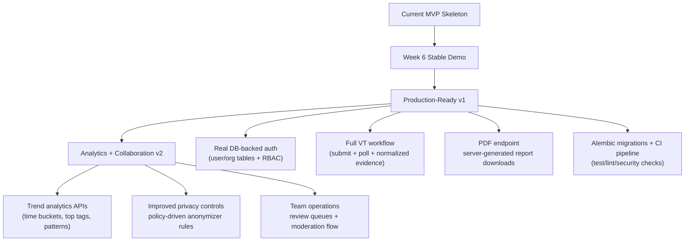

# cyber_guard_platform (Senior Project II Skeleton)

## Clone and Setup (Start Here)

### 1) Clone the repository
```bash
git clone https://github.com/cl0udz1/cyber_guard_platform.git
cd cyber_guard_platform
```

### 2) Backend setup
```bash
cd backend
python -m venv .venv
# Windows PowerShell:
.venv\Scripts\Activate.ps1
# macOS/Linux:
# source .venv/bin/activate
cp .env.example .env
pip install -r requirements.txt
uvicorn app.main:app --reload
```

Backend URL: `http://localhost:8000`

### 3) Frontend setup (new terminal)
```bash
cd frontend
cp .env.example .env
npm install
npm run dev
```

Frontend URL: `http://localhost:5173`

### 4) Run backend tests
```bash
cd backend
pytest -q
```

## 6-Week Execution Files (Follow These)

Use these six files as your week-by-week implementation checklist:

1. `docs/WEEK_1_TODO.md`
2. `docs/WEEK_2_TODO.md`
3. `docs/WEEK_3_TODO.md`
4. `docs/WEEK_4_TODO.md`
5. `docs/WEEK_5_TODO.md`
6. `docs/WEEK_6_TODO.md`

How to follow them:
- Start from Week 1 and move in order to Week 6.
- Use A/B/C/D/E/F role assignments shown in each file.
- At the end of each week, mark completed tasks and carry unfinished items to the next week.
- Sync changes to GitHub weekly with one clear commit per week milestone.

## Architecture Diagrams

### 1) Current Repository Structure


### 2) Current Runtime/Data Flow (MVP Skeleton)


### 3) Future Target State (Smart Growth Path)


### 4) Additional Detailed Diagrams
- [`docs/diagrams/API_SEQUENCE.md`](docs/diagrams/API_SEQUENCE.md)
- [`docs/diagrams/DATABASE_ERD.md`](docs/diagrams/DATABASE_ERD.md)

## Header
- Purpose: Starter codebase for a cybersecurity web platform with guest scanning, organization login, anonymized IoC sharing, and dashboard basics.
- Inputs/Outputs: Backend API + frontend web app + PostgreSQL schema + tests + docs.
- Dependencies: FastAPI, SQLAlchemy, PostgreSQL, React (Vite), pytest.
- TODO Checklist:
  - [ ] Implement full VirusTotal workflow (submit + poll + richer parsing).
  - [ ] Replace demo auth with real user registration and password storage flow.
  - [ ] Expand dashboard trends and charting.
  - [ ] Add migration scripts and CI pipeline.

## Project Idea Implemented
This scaffold follows the required **cyber_guard_platform** MVP:
- Guest scan URL/file through VirusTotal integration wrapper.
- Safety report output: `SAFE | SUSPICIOUS | MALICIOUS`.
- Organization login with JWT token.
- Anonymous IoC submission with **Disconnect by Design** enforcement.
- Dashboard summary with counts and recent records.

## Quick Start

### 1) Backend
```bash
cd backend
cp .env.example .env
pip install -r requirements.txt
uvicorn app.main:app --reload
```

Backend default URL: `http://localhost:8000`

### 2) Frontend
```bash
cd frontend
cp .env.example .env
npm install
npm run dev
```

Frontend default URL: `http://localhost:5173`

### 3) Run Backend Tests
```bash
cd backend
pytest -q
```

## Required API Endpoints (Implemented Skeleton)
- `POST /api/v1/scan/url`
- `POST /api/v1/scan/file`
- `GET /api/v1/scan/{scan_id}`
- `POST /api/v1/auth/login`
- `GET /api/v1/auth/me`
- `POST /api/v1/ioc/submit`
- `GET /api/v1/dashboard/summary`

## Privacy Rule (Critical)
IoC storage intentionally excludes submitter identity linkage:
- No `user_id`
- No `org_id`
- No IP/email/username linkage
- `anonymizer.py` rejects identity-like fields and unexpected extras

Stored IoC shape is limited to:
`type`, `value`, `confidence`, `tags`, `first_seen`, `created_at`.

## Documentation
- `docs/PROJECT_PLAN.md` - weekly execution roadmap.
- `docs/API_CONTRACT.md` - request/response contract details.
- `docs/TEST_PLAN.md` - test strategy and traceability matrix.

## Notes for Student Teams
- Uploaded files are never executed; only hashed and looked up.
- Scan caching exists:
  - file scans by SHA-256
  - URL scans by normalized URL
- VirusTotal failures and rate limits are handled with retry-aware skeleton code.
