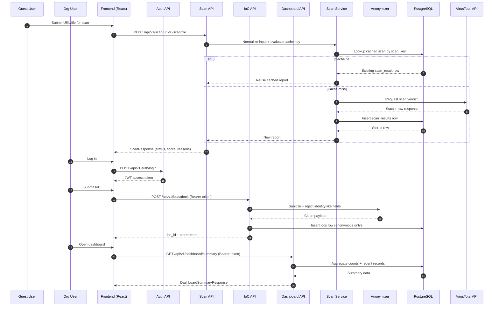

# API Sequence Diagram - cyber_guard_platform

## Purpose
- Show end-to-end request flow for core MVP interactions.
- Clarify where cache hits/misses and privacy enforcement happen.

```mermaid
sequenceDiagram
    autonumber
    participant G as Guest User
    participant O as Org User
    participant FE as Frontend (React)
    participant AUTH as Auth API
    participant SCAN as Scan API
    participant IOC as IoC API
    participant DASH as Dashboard API
    participant SS as Scan Service
    participant ANON as Anonymizer
    participant DB as PostgreSQL
    participant VT as VirusTotal API

    G->>FE: Submit URL/file for scan
    FE->>SCAN: POST /api/v1/scan/url or /scan/file
    SCAN->>SS: Normalize input + evaluate cache key
    SS->>DB: Lookup cached scan by scan_key
    alt Cache hit
        DB-->>SS: Existing scan_result row
        SS-->>SCAN: Reuse cached report
    else Cache miss
        SS->>VT: Request scan verdict
        VT-->>SS: Stats + raw response
        SS->>DB: Insert scan_results row
        DB-->>SS: Stored row
        SS-->>SCAN: New report
    end
    SCAN-->>FE: ScanResponse (status, score, reasons)

    O->>FE: Log in
    FE->>AUTH: POST /api/v1/auth/login
    AUTH-->>FE: JWT access token

    O->>FE: Submit IoC
    FE->>IOC: POST /api/v1/ioc/submit (Bearer token)
    IOC->>ANON: Sanitize + reject identity-like fields
    ANON-->>IOC: Clean payload
    IOC->>DB: Insert iocs row (anonymous only)
    IOC-->>FE: ioc_id + stored=true

    O->>FE: Open dashboard
    FE->>DASH: GET /api/v1/dashboard/summary (Bearer token)
    DASH->>DB: Aggregate counts + recent records
    DB-->>DASH: Summary data
    DASH-->>FE: DashboardSummaryResponse
```
