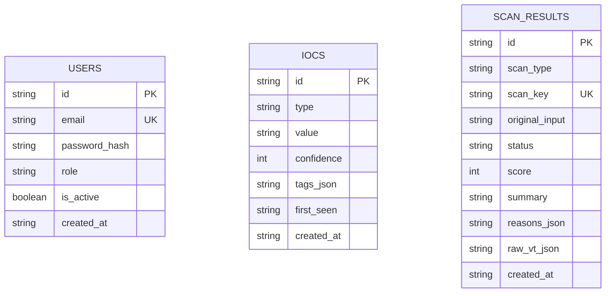

# Database ERD - cyber_guard_platform

## Purpose
- Document current SQLAlchemy table layout used by the MVP skeleton.
- Highlight the intentional anonymity rule for IoC submissions.

Notes:
- `iocs` has no `user_id` or `org_id` foreign key by design.
- `scan_results.scan_key` is unique and used for cache lookups.
