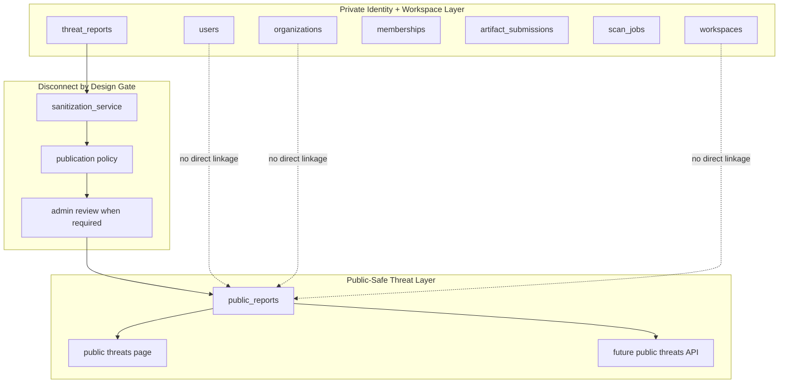

# DATA_SEPARATION.md

```mermaid
flowchart TB
    subgraph Private["Private Identity + Workspace Layer"]
        USERS[users]
        ORGS[organizations]
        WORKSPACES[workspaces]
        MEMBERSHIPS[memberships]
        SUBMISSIONS[artifact_submissions]
        JOBS[scan_jobs]
        REPORTS[threat_reports]
    end

    subgraph Gate["Disconnect by Design Gate"]
        SANITIZER[sanitization_service]
        POLICY[publication policy]
        REVIEW[admin review when required]
    end

    subgraph Public["Public-Safe Threat Layer"]
        PUBLICREPORTS[public_reports]
        FEED[public threats page]
        PUBLICAPI[future public threats API]
    end

    REPORTS --> SANITIZER
    SANITIZER --> POLICY
    POLICY --> REVIEW
    REVIEW --> PUBLICREPORTS
    PUBLICREPORTS --> FEED
    PUBLICREPORTS --> PUBLICAPI

    USERS -. no direct linkage .-> PUBLICREPORTS
    ORGS -. no direct linkage .-> PUBLICREPORTS
    WORKSPACES -. no direct linkage .-> PUBLICREPORTS
```

Public records shown here are intentionally sanitized outputs, not direct private report mirrors.
