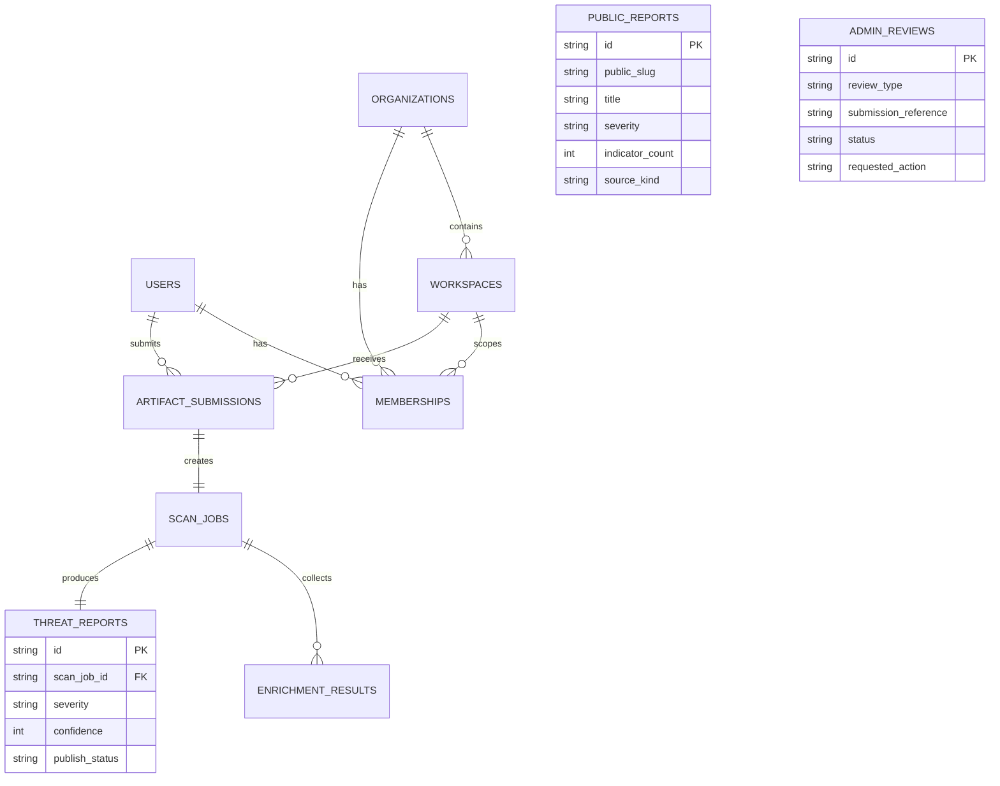

# ERD.md

```mermaid
erDiagram
    USERS ||--o{ MEMBERSHIPS : has
    ORGANIZATIONS ||--o{ WORKSPACES : contains
    ORGANIZATIONS ||--o{ MEMBERSHIPS : has
    WORKSPACES ||--o{ MEMBERSHIPS : scopes
    WORKSPACES ||--o{ ARTIFACT_SUBMISSIONS : receives
    USERS ||--o{ ARTIFACT_SUBMISSIONS : submits
    ARTIFACT_SUBMISSIONS ||--|| SCAN_JOBS : creates
    SCAN_JOBS ||--o{ ENRICHMENT_RESULTS : collects
    SCAN_JOBS ||--|| THREAT_REPORTS : produces

    THREAT_REPORTS {
        string id PK
        string scan_job_id FK
        string severity
        int confidence
        string publish_status
    }

    PUBLIC_REPORTS {
        string id PK
        string public_slug
        string title
        string severity
        int indicator_count
        string source_kind
    }

    ADMIN_REVIEWS {
        string id PK
        string review_type
        string submission_reference
        string status
        string requested_action
    }

    %% Privacy note:
    %% PUBLIC_REPORTS intentionally has no FK to USERS, ORGANIZATIONS, WORKSPACES, or THREAT_REPORTS.
    %% ADMIN_REVIEWS support moderation flow, but they should not weaken the public/private separation rule.
```
