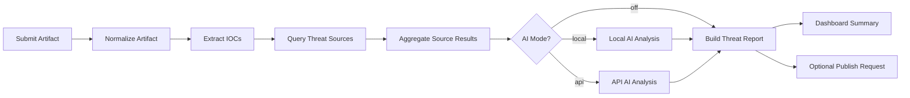

# SCAN_PIPELINE.md

```mermaid
flowchart LR
    SUBMIT[Submit Artifact] --> NORMALIZE[Normalize Artifact]
    NORMALIZE --> EXTRACT[Extract IOCs]
    EXTRACT --> QUERY[Query Threat Sources]
    QUERY --> AGGREGATE[Aggregate Source Results]
    AGGREGATE --> AIMODE{AI Mode?}
    AIMODE -->|off| REPORT[Build Threat Report]
    AIMODE -->|local| LOCAL[Local AI Analysis]
    AIMODE -->|api| REMOTE[API AI Analysis]
    LOCAL --> REPORT
    REMOTE --> REPORT
    REPORT --> DASH[Dashboard Summary]
    REPORT --> SHARE[Optional Publish Request]
```
