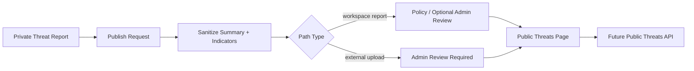

# SHARING_REVIEW_FLOW.md

```mermaid
flowchart LR
    PRIVATE[Private Threat Report] --> REQUEST[Publish Request]
    REQUEST --> SANITIZE[Sanitize Summary + Indicators]
    SANITIZE --> PATH{Path Type}

    PATH -->|workspace report| REVIEW1[Policy / Optional Admin Review]
    PATH -->|external upload| REVIEW2[Admin Review Required]

    REVIEW1 --> PUBLIC[Public Threats Page]
    REVIEW2 --> PUBLIC
    PUBLIC --> API[Future Public Threats API]
```
