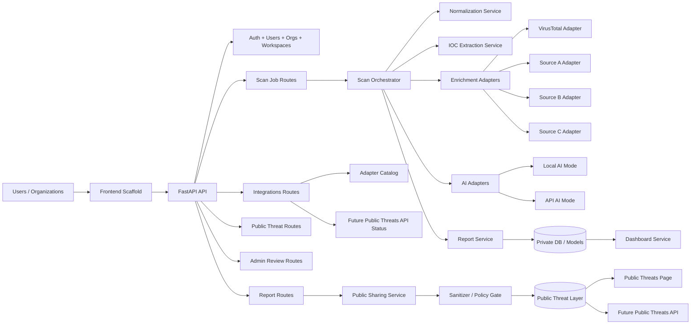

# SYSTEM_OVERVIEW.md

```mermaid
flowchart LR
    U[Users / Organizations] --> FE[Frontend Scaffold]
    FE --> API[FastAPI API]

    API --> AUTH[Auth + Users + Orgs + Workspaces]
    API --> JOBS[Scan Job Routes]
    API --> REPORTS[Report Routes]
    API --> PUBLIC[Public Threat Routes]
    API --> ADMIN[Admin Review Routes]
    API --> INTEGRATIONS[Integrations Routes]

    JOBS --> ORCH[Scan Orchestrator]
    ORCH --> NORM[Normalization Service]
    ORCH --> IOC[IOC Extraction Service]
    ORCH --> ENRICH[Enrichment Adapters]
    ORCH --> AI[AI Adapters]
    ORCH --> REP[Report Service]

    ENRICH --> VT[VirusTotal Adapter]
    ENRICH --> A[Source A Adapter]
    ENRICH --> B[Source B Adapter]
    ENRICH --> C[Source C Adapter]

    AI --> LOCAL[Local AI Mode]
    AI --> REMOTE[API AI Mode]
    INTEGRATIONS --> CATALOG[Adapter Catalog]
    INTEGRATIONS --> API2[Future Public Threats API Status]

    REP --> PRIVATE[(Private DB / Models)]
    REPORTS --> SHARE[Public Sharing Service]
    SHARE --> SAN[Sanitizer / Policy Gate]
    SAN --> PUBLICDB[(Public Threat Layer)]

    PRIVATE --> DASH[Dashboard Service]
    PUBLICDB --> FEED[Public Threats Page]
    PUBLICDB --> API3[Future Public Threats API]
```
